# RVM.AuthForge - Manual do Usuario

> Sistema IAM com OpenIddict — Guia Completo de Funcionalidades
>
> Gerado em 26/04/2026 | RVM Tech

---

## Visao Geral

O **RVM.AuthForge** e um sistema IAM de portfolio com OpenIddict 7.4, Blazor Server (admin) e React (portal).

**Recursos principais:**
- **OIDC completo** — Authorization Code Flow + PKCE, refresh tokens
- **Painel admin Blazor** — gerenciamento de usuarios, roles e clients
- **Portal React** — login, registro, perfil e 2FA para usuarios finais
- **2FA via TOTP** — suporte a Google Authenticator, Authy e similares
- **API Keys** — integracao M2M com autenticacao por chave
- **Audit Log** — rastreabilidade completa de eventos de seguranca

---

## 1. Pagina Inicial

Pagina de entrada do RVM.AuthForge. Apresenta o sistema IAM e oferece acesso ao painel administrativo e ao portal de autenticacao React.

**Funcionalidades:**
- Apresentacao do sistema IAM
- Link para painel admin Blazor
- Link para portal de autenticacao React
- Status do servico de autenticacao

| Desktop | Mobile |
|---------|--------|
|  | 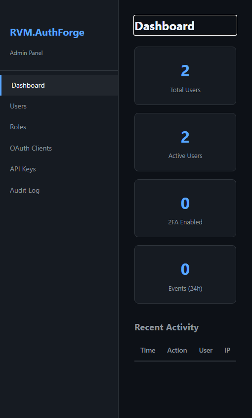 |

---

## 2. Dashboard Administrativo

Painel central do administrador. Exibe estatisticas globais do sistema: total de usuarios, roles configuradas, clients OIDC registrados e atividade recente.

**Funcionalidades:**
- Contagem total de usuarios, roles e clients
- Grafico de atividade de login recente
- Alertas de seguranca (tentativas de login falhas)
- Navegacao lateral para todas as secoes admin

| Desktop | Mobile |
|---------|--------|
| 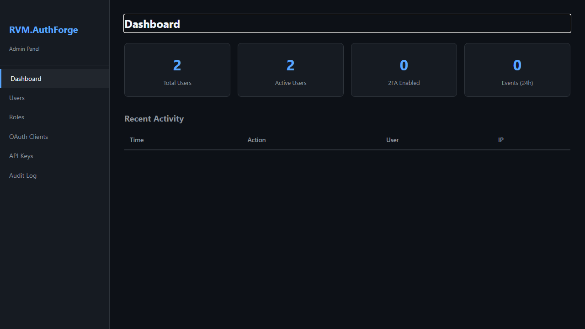 |  |

---

## 3. Gerenciamento de Usuarios

Lista completa de usuarios cadastrados no sistema. Permite busca, filtro por status, visualizacao de detalhes, edicao de roles e desativacao de contas.

**Funcionalidades:**
- Listagem paginada de usuarios
- Busca por nome ou e-mail
- Filtro por status (ativo/inativo)
- Atribuicao e remocao de roles
- Desativacao de conta sem exclusao
- Visualizacao de detalhes individuais

> **Dicas:**
> - Use o filtro de roles para encontrar rapidamente administradores ou usuarios de modulos especificos.

| Desktop | Mobile |
|---------|--------|
| 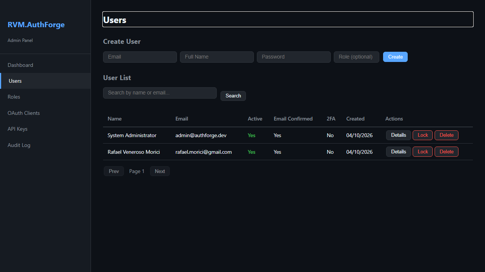 | 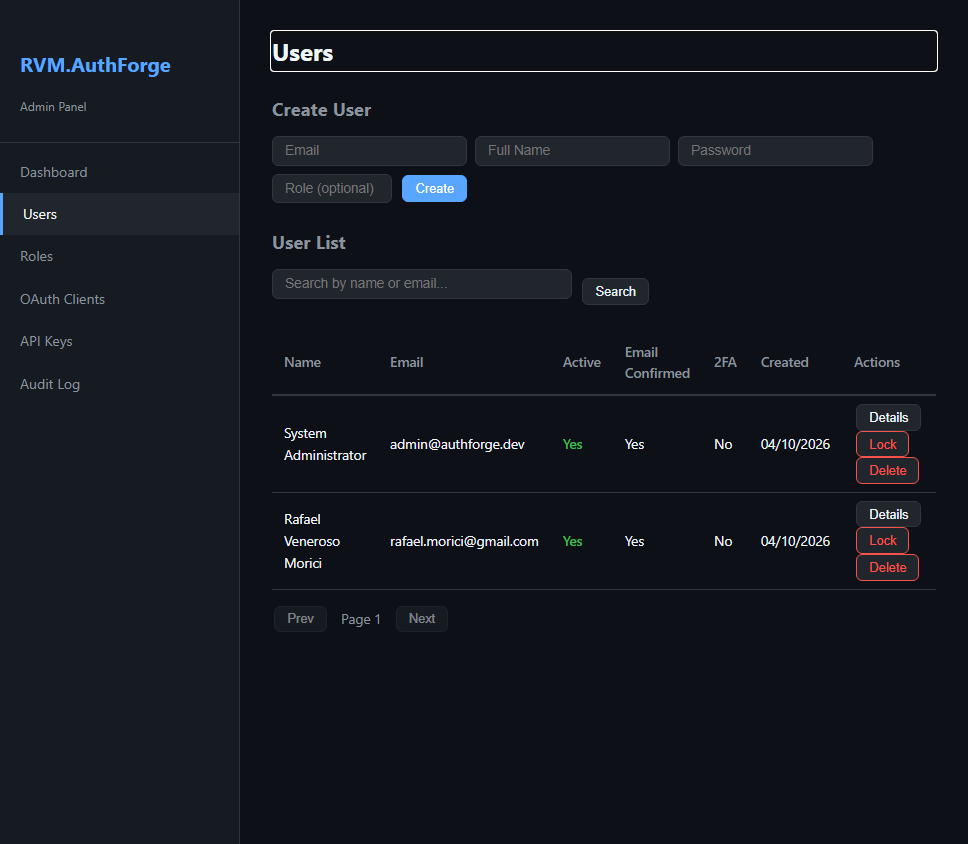 |

---

## 4. Gerenciamento de Roles

Configuracao das roles de acesso do sistema. Roles controlam quais funcionalidades cada usuario pode acessar nos diferentes modulos.

**Funcionalidades:**
- Criacao de novas roles
- Visualizacao de usuarios por role
- Edicao de descricao e permissoes
- Remocao de roles nao utilizadas

| Desktop | Mobile |
|---------|--------|
| 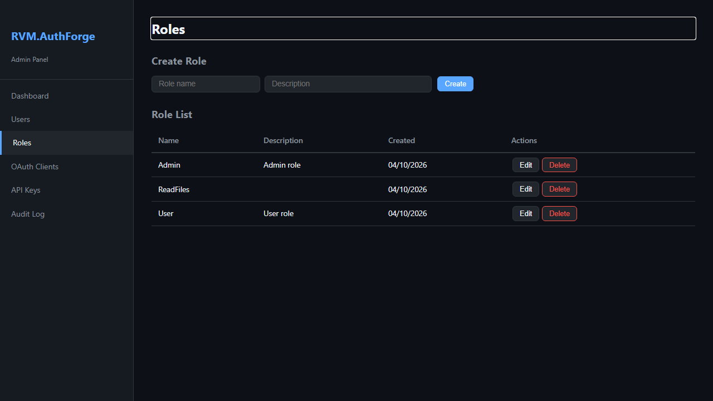 | 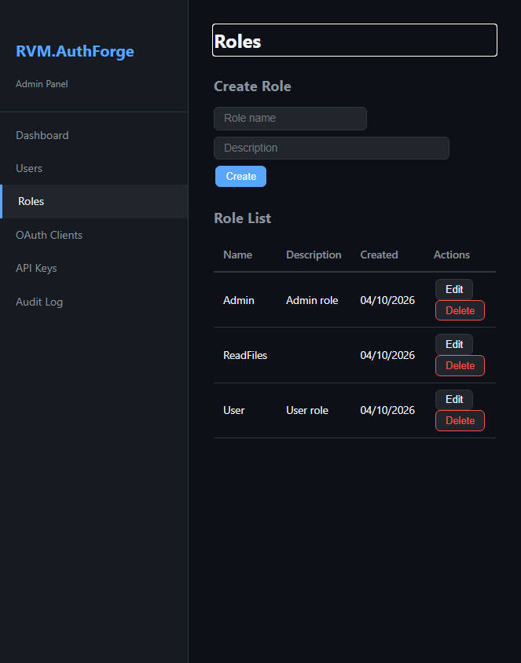 |

---

## 5. Clients OIDC

Gerenciamento de aplicacoes clientes registradas no provedor OIDC. Cada client representa uma aplicacao que usa o AuthForge para autenticacao.

**Funcionalidades:**
- Listagem de clients registrados (Confidential/Public)
- Configuracao de redirect URIs
- Definicao de scopes permitidos
- Rotacao de client secrets
- Suporte a Authorization Code Flow + PKCE

> **Dicas:**
> - Clients publicos (SPAs/mobile) devem usar PKCE sem client secret.
> - Clients confidenciais (server-side) usam client secret.

| Desktop | Mobile |
|---------|--------|
| 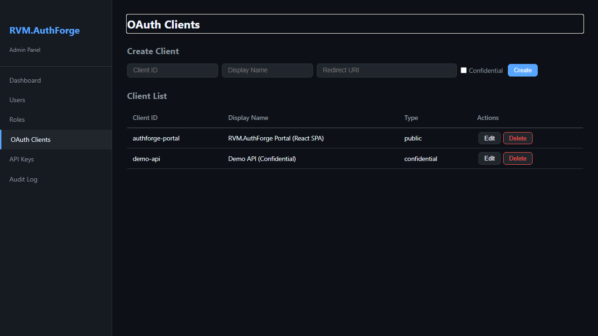 | 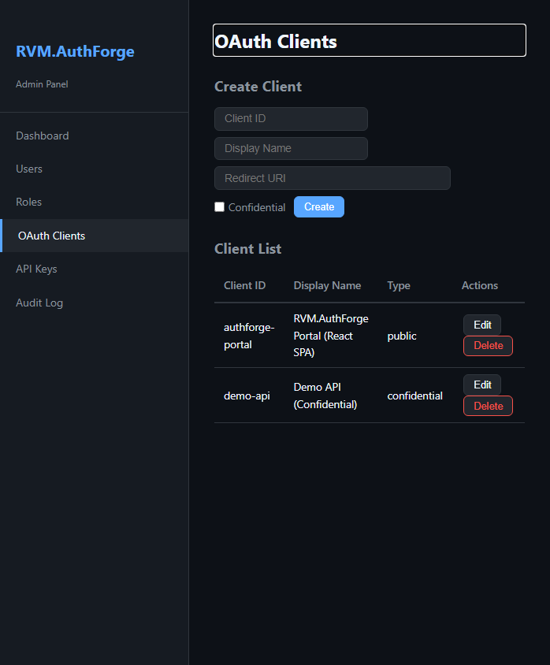 |

---

## 6. API Keys

Gerenciamento de chaves de API para integracao M2M (Machine-to-Machine). As API Keys permitem que servicos backend acessem endpoints protegidos sem fluxo de usuario.

**Funcionalidades:**
- Geracao de novas API Keys (plain text exibido apenas uma vez)
- Rotulo e descricao por chave
- Revogacao imediata de chaves comprometidas
- Armazenamento com hash SHA-256 (seguranca)

> **Dicas:**
> - Copie a chave no momento da criacao — ela nao sera exibida novamente.
> - Revogue imediatamente qualquer chave que tenha sido exposta.

| Desktop | Mobile |
|---------|--------|
| 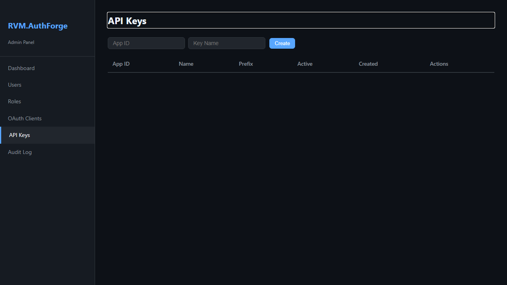 | 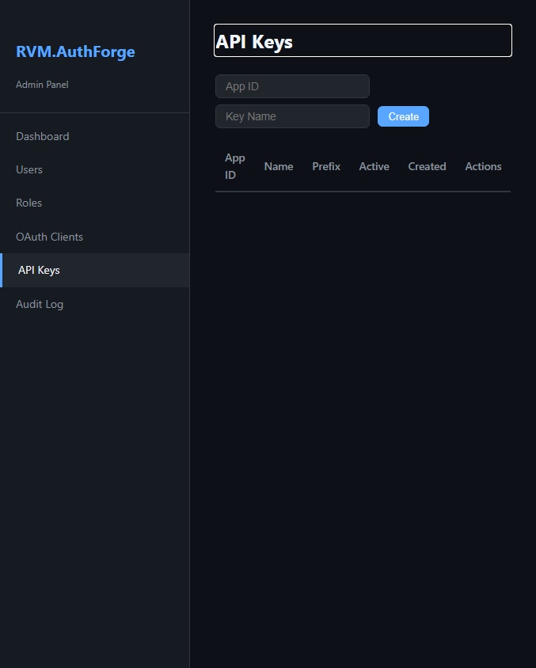 |

---

## 7. Log de Auditoria

Registro cronologico de todas as acoes relevantes no sistema: logins, alteracoes de usuarios, criacao de clients e uso de API Keys.

**Funcionalidades:**
- Historico completo de eventos de seguranca
- Filtro por tipo de evento, usuario e periodo
- Registro de IP e user-agent por evento
- Exportacao de logs para analise

| Desktop | Mobile |
|---------|--------|
| 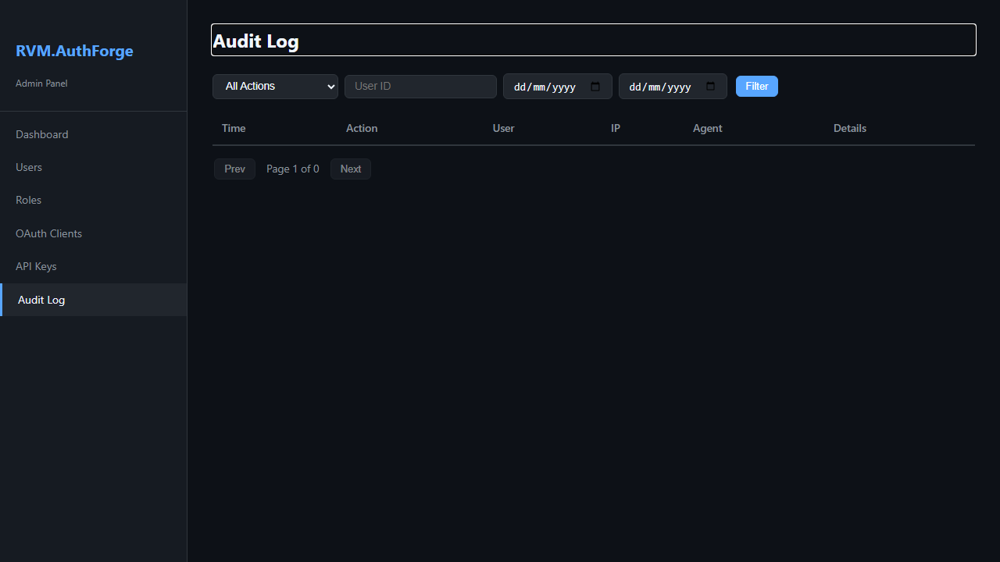 | 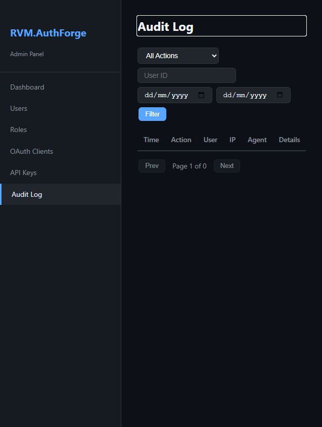 |

---

## 8. Portal — Login

Tela de login do portal React. Interface moderna e responsiva para autenticacao dos usuarios finais via OIDC Authorization Code Flow.

**Funcionalidades:**
- Login com e-mail e senha
- Suporte a fluxo OIDC completo (Authorization Code + PKCE)
- Redirecionamento apos autenticacao
- Link para registro e recuperacao de senha

| Desktop | Mobile |
|---------|--------|
|  |  |

---

## 9. Portal — Registro

Criacao de nova conta pelo portal React. Validacao em tempo real e feedback imediato ao usuario.

**Funcionalidades:**
- Campos: nome, e-mail, senha e confirmacao
- Validacao de forca de senha em tempo real
- E-mail de confirmacao enviado apos cadastro
- Redirecionamento automatico apos registro

| Desktop | Mobile |
|---------|--------|
|  |  |

---

## 10. Portal — Recuperacao de Senha

Fluxo de recuperacao de senha pelo portal. O usuario recebe um link por e-mail para redefinir a senha com seguranca.

**Funcionalidades:**
- Envio de link de redefinicao por e-mail
- Link com validade de 24 horas
- Confirmacao visual do envio do e-mail

| Desktop | Mobile |
|---------|--------|
|  |  |

---

## 11. Portal — Perfil

Gerenciamento de dados pessoais pelo portal. O usuario pode atualizar nome, e-mail e outras informacoes da conta.

**Funcionalidades:**
- Edicao de nome e e-mail
- Status de verificacao de e-mail
- Informacoes de sessao ativa
- Link para alteracao de senha

| Desktop | Mobile |
|---------|--------|
|  |  |

---

## 12. Portal — Autenticacao em Dois Fatores

Configuracao e gerenciamento do 2FA pelo portal React. Suporte a aplicativos autenticadores TOTP (Google Authenticator, Authy, etc.).

**Funcionalidades:**
- Ativacao/desativacao do 2FA
- QR Code para configurar aplicativo autenticador
- Codigos de recuperacao de emergencia
- Status do 2FA visivel no painel

> **Dicas:**
> - Ative o 2FA para maior seguranca da sua conta.
> - Guarde os codigos de recuperacao em local seguro.

| Desktop | Mobile |
|---------|--------|
|  |  |

---

## Informacoes Tecnicas

| Item | Detalhe |
|------|---------|
| **Tecnologia** | ASP.NET Core + Blazor Server (admin) + React 18 (portal) |
| **Autenticacao** | OpenIddict 7.4 (OAuth 2.0 / OpenID Connect) |
| **Banco de dados** | PostgreSQL 16 + ASP.NET Identity |
| **2FA** | TOTP (RFC 6238) via aplicativos autenticadores |
| **M2M** | API Keys com hash SHA-256 |

---

*Documento gerado automaticamente com Playwright + TypeScript — RVM Tech*
